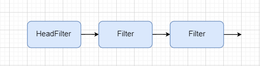

## 使用Filter

### Filter介绍

Filter是Slog的核心功能，通过Filter可以灵活的控制日志的输出，首先对日志记录器进行简要介绍。

在Slog中过滤器可归为四类：

- LoggerLevel：日志输出时经过的第一次过滤，作用域为单个Logger，用于控制Logger输出的最小的日志级别，`LoggerLevel`是一个不是过滤器的过滤器，因为他并没有继承`	Filter`抽象类；
- LoggerFilter：该过滤器作用域为单个Logger，实际上`LoggerFilter`的过滤是和`LoggerLevel`同时开始的，但是为了方便修改`LoggerLevel`的过滤级别，所以并没有将起封装成过滤器；
- WholeFilter：全局过滤器，该过滤器对所有的Logger的Appender都起作用，作用域为整个`Slog`，该过滤器在`LoggerFilter`之后执行过滤。
- AppenderFilter：Appender过滤器在日志消息被传送到Appender，即将被输出时进行过滤，通过该过滤后日志将被打印输出。

### Filter的链式结构

如上图，每个级别都可能存在多个过滤器，`Filter`采用链的数据结构，slog存储`headFilter`首个过滤器节点的引用，当进行过滤时需要通过整条Filter为通过过滤。

### 基础API

| 方法                                         | 说明                                     |
| -------------------------------------------- | ---------------------------------------- |
| public void setNextFilter(Filter nextFilter) | 设置下一个过滤器的引用                   |
| public Filter getNextFilter()                | 取得下一个过滤器的引用                   |
| public boolean decide(LoggingEvent event)    | 执行过滤，遍历从当前过滤器开始的过滤器链 |
| private boolean doDecide(LoggingEvent event) | 当前过滤器实际上的过滤判断条件           |

