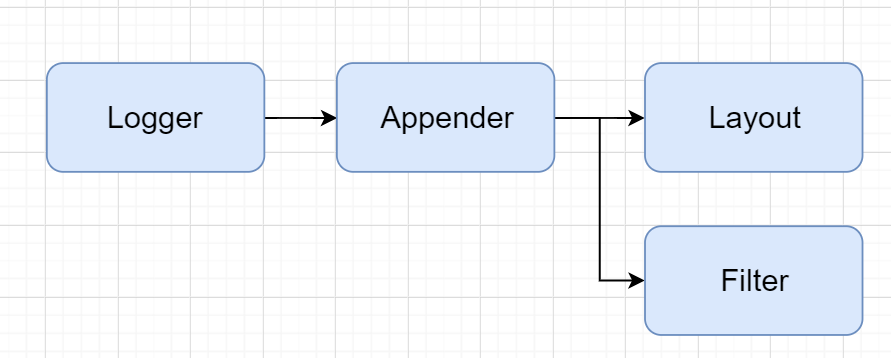
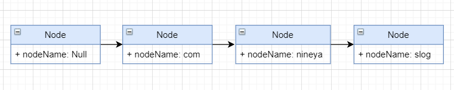
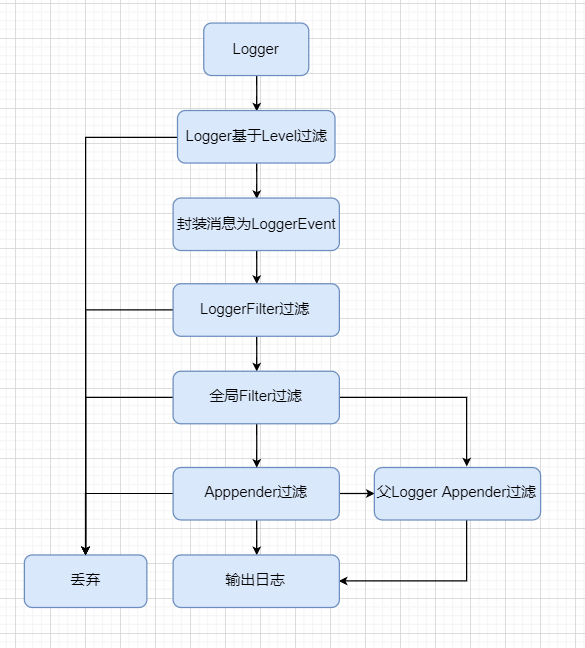

## 认识Snail Log

### 认识Logger和Logger的继承机制

`Logger`是Slog的核心，通过操作`Logger`对象进行日志信息的输入输出，`Appender`是实际上进行日志信息输出的对象，`Logger`与`Appender`具有一对一的关系，当创建一条日志信息满足`Logger`设置的日志级别要求时，`Logger`将其封装成`LoggerEvent`消息实体传给`Appender`，`Appender`根据内部的`Filter`进行过滤，通过过滤后使用`Layout`将消息转换为指定的样式进行输出。

除了`rootLogger`根日志记录器以外，每个日志记录器必定有父日志记录器，当没有显式指定父日志记录器时，默认根日志记录器为父日志记录器。`Logger`处理完日志消息后都将传给父日志记录器进行处理，直到根日志记录器，但是如果生成日志未达到的日志记录器的打印级别，那么将直接跳过本次日志打印，不会再去寻找父日志记录器。`Logger`的继承关系有助于灵活的组合和不同的`Appender`打印要求。

### 认识Node

在Slog中，所有日志记录器配置`class`过滤信息都将生成为`Node`中的一条记录。根据`.`分隔`Node`将会被分成一个具有继承关系的链路，根节点为`Null`，如包名`com.nineya.slog`将生成如下一条关系链路：

`Node`链路中的配置同样具有继承关系，当产生一条日志消息时，将从`Null`节点开始往后遍历包名的节点，子节点具有更高的权重，但是当子节点未进行配置时，将返回已有的父节点的配置信息。这样的结构可以方便我们通过包名进行日志控制，当需要对指定包中的所有子包进行日志控制时，只需要对父包名进行配置。

### Logger的消息过滤

上图是一条日志消息输出的流程，一条日志消息要输出出来，他将经过`Logger`和`Appender`的两次过滤，两次过滤都满足条件之后才会输出。

第一次`Logger`的过滤是基于`Node`实现的Logger Level的过滤，如果未达到日志记录器要求的最低日志打印级别，那么该消息将被直接丢弃，也不会遍历父日志记录器。

第二次`Appender`过滤在通过Logger Level过滤之后进行，消息没有通过`Appender`过滤仍将遍历父`Appender`过滤器。值得注意的是遍历的是父日志记录器的`Appender`，并非再通过父日志记录器进行输出，所以父日志记录器过滤的时候将不会进行Logger Level的过滤。